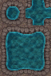
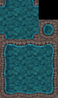

# 概要
このプログラムはフリーゲーム「魔石鉱道」の素材を制作する際に使用したPythonのソースコードをまとめたものである。以下のコードはPython3.11で、問題無く動くことが確認できている。

# コードの概要
## 音声の編集
### silent.py
&emsp;Unity上で音声を取り込む際、圧縮の都合上音声の始まりに急激な音の変化があるとノイズが発生するようになってしまった。その解決として、音の始まりに短い無音の時間をつけるようにした。（本来なら、その後Unity上で無音の時間分、音声の始まりを先送りにすべきなのだが、あまりにも労力がかかるので、別のゲームを作る際に改善点として役立てたいと思う）  
&emsp;このプログラムはnon_silentフォルダ内に入れたwaveファイルの音声データのすべてに先頭に無音をつけた状態でmp3に変換し、silentフォルダに保存する。

### change.py
&emsp;Unityで作成したゲームをWebGL形式で出力する際、wavファイルは非推奨であった。そのため、wav形式の音声をmp3形式に変換するプログラムを作成した。このプログラムでは、input_audioにあるすべてのwavファイルをmp3に変換し、output_audioに保存している。

## 画像の編集
### opencv_test.py
&emsp;このプログラムは確認用のプログラムであり、OpenCVで読み込んだ画像の左上から縦横の大きさが(32px, 64px)の画像を切り取るものである。直接ゲームに使用した訳ではないが、画像を問題無く表示できていることが確認できた。

### opencv_test2.py
&emsp;取り扱う画像は縦横の大きさが(96px, 64px)でひとまとまりになっているため、その単位で分割することが望ましい。そのため、引数に画像ファイルの名前を与えることで、outputフォルダ内に分割したすべての画像ファイルを出力するプログラムを作った。

### opencv_test3.py
&emsp;opencv_test2.pyで分割した画像は、Unity上では(32px, 32px)ずつ分割して使用する。しかし、画像を見るとわかるようにそのまま分割すると中央の画像が無いため、画像をつなげてフィールドを作るのが少々大変である。そのため、さらに扱いやすいように引数に与えた名前の画像を(16px, 16px)ごとに分割し、配置し直すプログラムを作った。配置の指定はbefore_image_format.csvで番号を振り分け、after_image_format.csvで指定する。フォルダ内にあるcsvファイルをそのまま適用すると以下のようになる。

# 制作情報
* 制作者:スカキヨ
* email:sukasukakiyokiyo843@gmail.com
* 画像:ドット絵世界